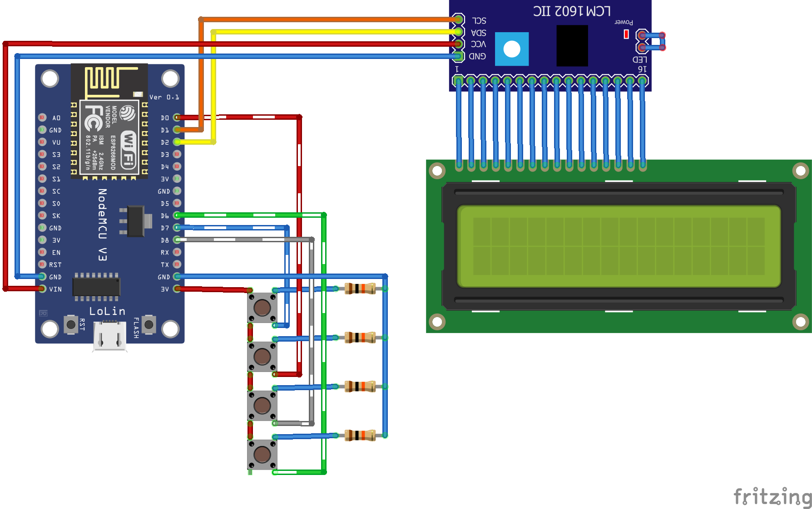

<!-- Improved compatibility of back to top link: See: https://github.com/othneildrew/Best-README-Template/pull/73 -->
<a name="readme-top"></a>
<!--
*** Thanks for checking out the Best-README-Template. If you have a suggestion
*** that would make this better, please fork the repo and create a pull request
*** or simply open an issue with the tag "enhancement".
*** Don't forget to give the project a star!
*** Thanks again! Now go create something AMAZING! :D
-->


<!-- PROJECT SHIELDS -->
<!--
*** I'm using markdown "reference style" links for readability.
*** Reference links are enclosed in brackets [ ] instead of parentheses ( ).
*** See the bottom of this document for the declaration of the reference variables
*** for contributors-url, forks-url, etc. This is an optional, concise syntax you may use.
*** https://www.markdownguide.org/basic-syntax/#reference-style-links
-->
[![Contributors][contributors-shield]][contributors-url]
[![Forks][forks-shield]][forks-url]
[![Stargazers][stars-shield]][stars-url]
[![Issues][issues-shield]][issues-url]
[![MIT License][license-shield]][license-url]
[![LinkedIn][linkedin-shield]][linkedin-url]


<!-- PROJECT LOGO -->
<!-- <br />
<div align="center">
  <a href="https://github.com/trasbd/SFSL-ESP-Turnstile">
    
  </a> -->
<br>
<h3 align="center">SFSL-ESP-Turnstile</h3>
  <p align="center">
    <br />
    <a href="https://github.com/trasbd/SFSL-ESP-Turnstile"><strong>Explore the docs »</strong></a>
    <br />
    <br />
    <a href="https://github.com/trasbd/SFSL-ESP-Turnstile">View Demo</a>
    ·
    <a href="https://github.com/trasbd/SFSL-ESP-Turnstile/issues">Report Bug</a>
    ·
    <a href="https://github.com/trasbd/SFSL-ESP-Turnstile/issues">Request Feature</a>
  </p>
</div>


<!-- TABLE OF CONTENTS -->
<details>
  <summary>Table of Contents</summary>
  <ol>
    <li>
      <a href="#about-the-project">About The Project</a>
      <ul>
        <li><a href="#built-with">Built With</a></li>
      </ul>
    </li>
    <li><a href="#hardware">Hardware</a></li>
    <li><a href="#database">Database</a></li>
    <li><a href="#web-server">Web Server</a></li>
    <li><a href="#roadmap">Roadmap</a></li>
    <li><a href="#license">License</a></li>
    <li><a href="#contact">Contact</a></li>
  </ol>
</details>


<!-- ABOUT THE PROJECT -->
## About The Project

<P>Replaces mechanical turnstile/clicker and manual calculation with an ESP8266 that automatically reports counts to an MSSQL Server. 
<br>The ESP uses HTTP POST/GET requests that are handled by an IIS server running PHP.
<br>
<br> <b>NOTE:</b> Project has not been adopted and development has stopped.</p>

<!--
<br> -->

<p align="right">(<a href="#readme-top">back to top</a>)</p>


### Built With


<p align="right">(<a href="#readme-top">back to top</a>)</p>


<!-- GETTING STARTED -->
## Hardware

* 1 x ESP8266 (NodeMCU v3)
* 1 x LCD 2x16 (PCF8574 Attached)
* 4 x Momentary Push Button
* 4 x 10kΩ Resistor

<br>

`secrets.h` will need to be created, in the Arduino Project, with the following content. Replace `YOUR SSID` and `YOUR SSID PASSWORD` with the appropriate information.

   ```c
#define SECRET_SSID "YOUR SSID"
#define SECRET_PASS "YOUR SSID PASSWORD"
   ```

<br>

<p align="right">(<a href="#readme-top">back to top</a>)</p>

## Database

Three tables are required:
* hourly
* seats
* mac

`seats` needs to be populated with Rides Names and Seats
<br>
`mac` needs to be populated with the ESP MAC Addresses, Ride assignment can be done from the Web Interface 

Sample ```CREATE TABLE``` files are included
<br>
Sample data set for `seats` is included

<br>

### hourly

| Column      | Type             | Description |
| ----------- | --------------------- | - |
| date | date | Date of Count |
| time | time | Time of Count |
| ride | text | Ride Name |
| units | int | Number of Trains, Channels, RVs, Cars, etc |
| cycles | int | Ride Cycle Count |
| empty | int | Empty Seats |
| hourly | int | Calculated Count |
| wait | int | Ride Wait Time in Minutes |

### seats

| Column      | Type             | Description |
| ----------- | --------------------- | - |
| ride | text | Ride Name |
| seats | int | Total Number of Seats per Cycle |

### mac

| Column      | Type             | Description |
| ----------- | --------------------- | - |
| ride | text | Ride Name |
| mac | text | MAC address of ESP8266 |

<p align="right">(<a href="#readme-top">back to top</a>)</p>


## Web Server

This project was tested using `Windows Server 2019` running `IIS`, `Microsft SQL Server 2022`, and `PHP 8.2.9`

Project assumes that the IIS Server and MSSQL Server are on the same host.

Instructions for setting up PHP with IIS can be found here:
<br><a href="">CHANGE LINK</a>

`index.php` should be added to the web server list of default pages.

`secrets.php` will need to be created with the following content. Replace defaults with appropriate information.

   ```php
<?php
$DB_USER = "YOUR DB USER";
$DB_PASS = "YOUR DB USER PASSWORD";
$DB_NAME = "YOUR DB NAME";
?>
   ```

CSS files are not included

### Turnstile Report

Page has not been developed
<br>
<br>
Displays all the hourlies from one ride for the selected day and park hours
<br>Displays the accumulated riders, percent utilization, and rides per guest

### Hourly

Displays the hourly count from all rides at the selected Date/Time
<br>Defaults to the most recent hourly


### Assign Clicker

Allows easy assignment of the ESP to Rides.
<br> The assignment allows the ESP to pull in the number of seats and post the correct ride name
<br><br>
MAC Addresses are pulled from the `mac` table
<br>Ride Names are pulled from the `seats` table


<p align="right">(<a href="#readme-top">back to top</a>)</p>


<!-- USAGE EXAMPLES 
## Usage

   ```python
   python .\SFSL-ESP-Turnstile.py
   ```

<p align="right">(<a href="#readme-top">back to top</a>)</p>
-->

<!-- ROADMAP -->
## Roadmap

Project has not been adopted and development has stopped.

- [ ] Create Individual Turnstile Report Page
- [ ] Add Capacities
- [ ] Create Prototype Case
- [ ] Test on Site

See the [open issues](https://github.com/trasbd/SFSL-ESP-Turnstile/issues) for a full list of proposed features (and known issues).

<p align="right">(<a href="#readme-top">back to top</a>)</p>


<!-- CONTRIBUTING 
## Contributing

Contributions are what make the open source community such an amazing place to learn, inspire, and create. Any contributions you make are **greatly appreciated**.

If you have a suggestion that would make this better, please fork the repo and create a pull request. You can also simply open an issue with the tag "enhancement".
Don't forget to give the project a star! Thanks again!

1. Fork the Project
2. Create your Feature Branch (`git checkout -b feature/AmazingFeature`)
3. Commit your Changes (`git commit -m 'Add some AmazingFeature'`)
4. Push to the Branch (`git push origin feature/AmazingFeature`)
5. Open a Pull Request

<p align="right">(<a href="#readme-top">back to top</a>)</p>

-->

<!-- LICENSE -->
## License

<p align="right">(<a href="#readme-top">back to top</a>)</p>


<!-- CONTACT -->
## Contact

Thomas Robert

Project Link: [https://github.com/trasbd/SFSL-ESP-Turnstile](https://github.com/trasbd/SFSL-ESP-Turnstile)

<p align="right">(<a href="#readme-top">back to top</a>)</p>


<!-- ACKNOWLEDGMENTS 
## Acknowledgments

<p align="right">(<a href="#readme-top">back to top</a>)</p>

-->

<!-- MARKDOWN LINKS & IMAGES -->
<!-- https://www.markdownguide.org/basic-syntax/#reference-style-links -->
[contributors-shield]: https://img.shields.io/github/contributors/trasbd/SFSL-ESP-Turnstile.svg?style=for-the-badge
[contributors-url]: https://github.com/trasbd/SFSL-ESP-Turnstile/graphs/contributors
[forks-shield]: https://img.shields.io/github/forks/trasbd/SFSL-ESP-Turnstile.svg?style=for-the-badge
[forks-url]: https://github.com/trasbd/SFSL-ESP-Turnstile/network/members
[stars-shield]: https://img.shields.io/github/stars/trasbd/SFSL-ESP-Turnstile.svg?style=for-the-badge
[stars-url]: https://github.com/trasbd/SFSL-ESP-Turnstile/stargazers
[issues-shield]: https://img.shields.io/github/issues/trasbd/SFSL-ESP-Turnstile.svg?style=for-the-badge
[issues-url]: https://github.com/trasbd/SFSL-ESP-Turnstile/issues
[license-shield]: https://img.shields.io/github/license/trasbd/SFSL-ESP-Turnstile.svg?style=for-the-badge
[license-url]: https://github.com/trasbd/SFSL-ESP-Turnstile/blob/master/LICENSE.txt
[linkedin-shield]: https://img.shields.io/badge/-LinkedIn-black.svg?style=for-the-badge&logo=linkedin&colorB=555
[linkedin-url]: https://linkedin.com/in/thomas-robert-142b02b2
[product-screenshot]: images/screenshot.png

